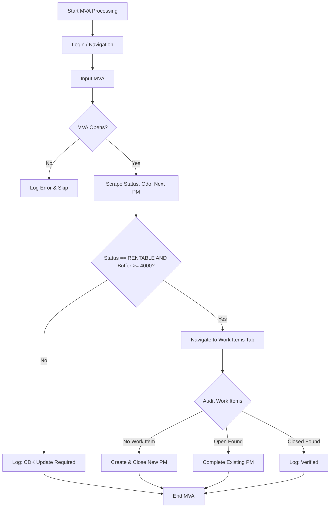

# 📋 Overview: Fleet PM Data Integrity Auditor
The **Fleet PM Data Integrity Auditor** is designed as a post-service verification tool. It identifies and logs synchronization gaps between the Legacy system (CDK) and the Greenfield application (Compass).

## 🚀 Operational Intent
This script is intended to run **AFTER** a vehicle's PM has been physically completed and the related data has ideally been entered into both CDK and Compass.

The mission of the script is two-fold:
1.  **Data Integrity Check**: Confirm that all core vehicle data (Operational Status and Mileage Targets) is properly synchronized and updated in the legacy system.
2.  **Documentation Enforcement**: Ensure that a corresponding Work Item record exists in Compass and is closed out. If the record is missing (a "Paperwork Gap"), the script creates and completes it to finalize the audit trail.

## �️ The Three Pillars of Truth
The Auditor navigates the intersection of three independent data sources:

| Source | Controls | Behavior |
| :--- | :--- | :--- |
| **CDK** | **[Next PM Mileage]** | **Automated**. Advances as exactly $Last + Interval$ upon service registration. This is our "Mileage Reality." |
| **Clerk** | **[Work Item]** | **Manual**. Requires a human to open, associate complaints, and close. This is our "Paperwork Trail." |
| **Peer Apps** | **[Lighthouse Status]** | **Systemic**. Updated by multiple fleet management tools. This is our "Operational Availability." |

## 🎯 The "Success State" Definition
A vehicle is considered **Synchronized and Healthy** when all three pillars align:
1.  **Status Reality**: **[Lighthouse Status]** is `RENTABLE` (Peer Apps are synced).
2.  **Mileage Reality**: **[Next PM Mileage]** - **[Wizard Odometer]** $\geq$ **[PM Interval]** (CDK has registered the PM).
3.  **Paperwork Reality**: A `Complete` or `Open` PM Work Item exists within the last **30 days** (Clerk has recorded the trail).

## 🛠️ Automated Remediation (The Auditor's Action)
If the **Mileage Reality** indicates a PM was performed, but the other pillars are lagging, the Auditor acts:

-   **Case: Status Lag**: Mileage is healthy, but Status is `PM` or `PMHH`.
    -   *Action*: Log as "Pending Legacy Entry" (Wait for peer apps to update status). No action taken by auditor.
-   **Case: Paperwork Gap**: Mileage is healthy, but recent Work Item is **Missing** or too **Old**.
    -   *Action*: The Auditor acts as the "Virtual Clerk" to sync the trail:
        1. Open existing Work Item (or Create New if missing).
        2. Associate PM Complaint.
        3. Clear Mileage/Opcode dialogs.
        4. Close with note: `Integrity Sync`.

### 🔍 Session Audit Discovery (MVA 58985080)
During the February 2026 session, the auditor detected a **Paperwork Gap** for MVA 58985080:
- **Status**: `RENTABLE` (Success)
- **Buffer**: `7000` (Success)
- **Problem**: Highest visible record was **12/7/2025**. A user-reported **1/28/2026** record was not present in the DOM.
- **Auditor Response**: Correctly triggered the "Virtual Clerk" flow to bridge the documentation gap.
- **Improvement**: Added robust date parsing (`re.search`) and flexible "Next" button handling to ensure the sync completes even when UI overlays are present.

---

## 🔄 Logic Gate Sequence

### Gate 1: The Validation (Gatekeeper)
For every MVA in the dataset:
-   **Check 1**: Is **[Lighthouse Status]** == `RENTABLE`?
-   **Check 2**: Is Buffer (**[Next PM Mileage]** - **[Wizard Odometer]**) $\geq$ 4,000 miles?

**IF NO to either**: 
-   **Log**: "CDK Update Required: [Reason]"
-   **Action**: **SKIP** (Move to next MVA). No corrective action is taken for vehicles failing these gates.

**IF YES to both**:
-   **Action**: Proceed to **Gate 2: Documentation Audit**.

### Gate 2: The Documentation Audit (Verification)
Search for a PM Work Item associated with the current service interval:
-   **Case A: No Work Item Found**
    -   **Action**: **Create** new PM Work Item + **Close** it (Address "Paperwork Gap").
-   **Case B: Open Work Item Found**
    -   **Action**: **Close** (Complete) the existing Work Item.
-   **Case C: Closed Work Item Found**
    -   **Action**: **No Action** (Verified Clean).

---

## 📊 Decision Matrix

| Status Field | Mileage Relationship | Audit Result | Script Action |
| :--- | :--- | :--- | :--- |
| **`RENTABLE`** | Buffer $\geq$ 4,000 | Record Missing | **Create & Complete** PM |
| **`RENTABLE`** | Buffer $\geq$ 4,000 | Record Exists | **Skip** (Verified) |
| **`RENTABLE`** | Buffer $<$ 4,000 | Data Lag (Pending Entry) | **Log Exception** & Skip |
| **`PM` / `PMHH`** | Any | Status Lag | **Log Exception** & Skip |
| **`OTHER`** | Any | Process Lag | **Log Exception** & Skip |

---
## 🛠 Business Rules & Constants
To ensure the Auditor remains consistent and safe, the following hardcoded values are applied during the "Create & Complete" workflow:

| Field | Standard Auditor Value | Reasoning |
| :--- | :--- | :--- |
| **Drivability** | `Yes` | Assumes Auditor is processing vehicles fit for service. |
| **Complaint Type** | `PM` | Standard trigger for Preventive Maintenance. |
| **Opcode** | `PM Gas` | Primary opcode for the majority of the fleet. |
| **Closing Note** | `Done` | Standard completion acknowledgment. |

---
## � Gap Analysis (GA) Scenario Examples

### Scenario: Data Lag (Pending Legacy Entry)
- **Input**:
    - Wizard Odometer: `11,375`
    - Next PM Mileage: `10,817`
- **Calculation**: $10,817 - 11,375 = -558$ (Gap < 4,000)
- **Result**: `[AUDITOR][SKIP] — CDK Update Required: Data Lag (Pending Legacy Entry).`
- **Explanation**: **Primary Cause**: The service has been physically performed, but the transaction has not yet been entered into the legacy system (CDK). Because the **[Next PM Mileage]** update is automated upon entry, a stale or negative runway is a definitive indicator that the batch update is pending.

### Scenario: Paperwork Gap (Healthy but Document Missing)
- **Input**:
    - Wizard Odometer: `5,000`
    - Next PM Mileage: `12,000`
- **Calculation**: $12,000 - 5,000 = 7,000$ (Gap $\geq$ 4,000)
- **Result**: Proceed to **Gate 2**. If no record exists → **Create & Complete PM**.
- **Explanation**: Vehicle is fully synced in CDK but missing documentation in Compass.

---

## �🔄 Logic Flow Diagram

## 🏗 Scope of Changes

### 1. Code Implementation
- [pages/vehicle_properties_page.py](pages/vehicle_properties_page.py):
  - Implement new locators to scrape Lighthouse status, Wizard Odometer, and Next PM Mileage from the vehicle properties container.
- [flows/work_item_flow.py](flows/work_item_flow.py):
  - Remove the legacy date-checking logic.
  - Add a new validation method in `handle_pm_workitems` to calculate the mileage gap and verify the `RENTABLE` status.
- [config/config.json](config/config.json):
  - Add a `mileage_threshold` key (set to `4000`) to allow for easy adjustments.
- [utils/logger.py](utils/logger.py):
  - Ensure logging helpers accommodate recording the calculated mileage gap for audit trails.

### 2. Documentation Updates
- [Markdown_Files/Architecture.md](Markdown_Files/Architecture.md): Update the Rules section to replace time-based logic with the new dual-factor mileage requirements.
- [Markdown_Files/History.md](Markdown_Files/History.md): Record the February 2026 milestone for the transition to mileage-based validation.
- [Markdown_Files/Practices.md](Markdown_Files/Practices.md): Update the Logging Strategy with examples reflecting the status and gap checks (e.g., `[MVA] {mva} — Gap: 1200 (< 4000). Creating new PM.`).
- [Markdown_Files/Session_Starter.md](Markdown_Files/Session_Starter.md): Update **Current State** and **Next Focus** to reflect the hardening of mileage-based navigation.
